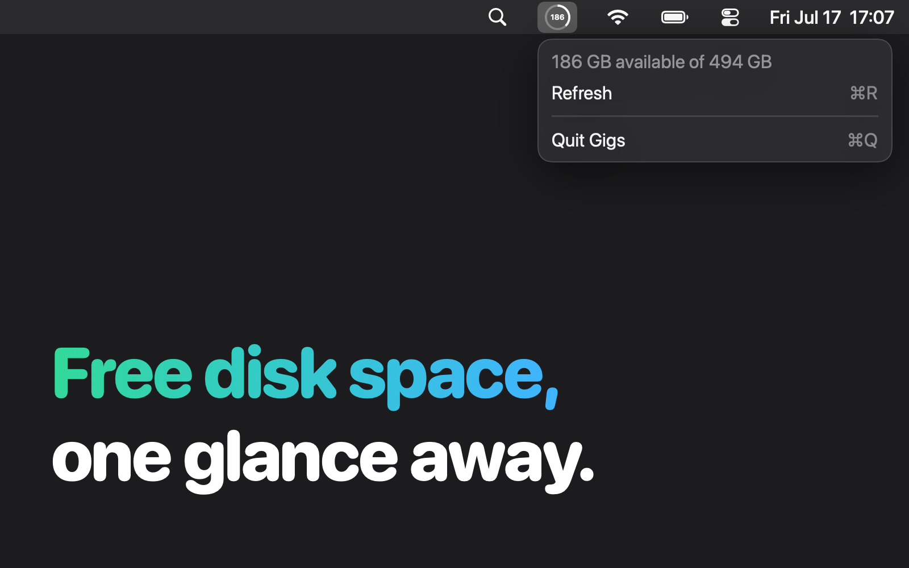

# Gigs



Gigs keeps your Mac's free disk space in the menu bar, so you notice it's running low before macOS tells you.

- The number is the gigabytes available on your startup disk. The ring around it fills with the share of the disk that's still free.
- The icon turns red when less than 20 GB are left.
- Click it to see available and total space, for example "186 GB available of 494 GB".
- It updates every minute. Press ⌘R in the menu to refresh right away.
- The number matches Finder: space macOS can purge on its own counts as free.
- No Dock icon, no window. It opens at login and stays out of the way.

Requires macOS 14 and Swift 6.

## Install

```sh
./install.sh
```

Builds in release mode, replaces `/Applications/Gigs.app`, signs it locally, registers it to open at login, and launches it.

## Run without installing

```sh
swift run
```

## License

MIT. See [LICENSE](LICENSE).
